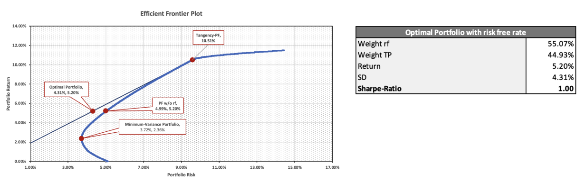

## Investing for the Future During Global Uncertainty: Practical Case Study

[Harvard Business School](https://store.hbr.org/product/strategic-asset-allocation-during-global-uncertainty/W18632) case study looking at a Singapore based investor who wants to ensure he is in a position to send his two daughters to college without putting a large hole in his portfolio.

### Case Description:

"This exercise places the reader in the position of an investor, who, before 2017, had invested for almost 20 years. Since the financial crisis in 2008-09, this investor had stayed away from the US market. The investor's return from the previous year stood at a mere 2 per cent. Given that many political events would likely occur in 2017, the investor hoped to revise their investment strategies at the time by developing a more internationalized portfolio. Specifically, the investor was considering how to allocate capital among the existing 10 broker-recommended exchange-traded funds traded on the Singapore stock exchange and two exchange-traded funds in alternative assets traded in the US market. The investor also needed to provide additional cash flows for the education of their two daughters from year two onward for a total of four years. The investor was also willing to reshuffle the investment portfolio to put more weights into the US market. However, before making the revised investment decision, the investor needed to consider the expected returns and risks."

### Case Tasks:

1. Analyze the past investment performance of this investor and the required return taking into
   account his/her family’s finance needs in the next 5 years. You are able to provide further
   appropriate assumptions if required.

2. Perform qualitative and quantitative analyzes and discuss advantages and disadvantages of
   adding two alternative investment vehicles (i.e. gold and RIET) in constructing efficient portfolios
   from initial 10 recommended ETFs

3. Recommend the optimal asset allocation of investing in the 10 EFTS + gold + REIT. You need
   to take into account the investor situation, preference and other issues you care. Use one-year
   T-bill rate as the risk-free rate.

## Proposed Solution:

Find a portfolio that fits the client's risk profile, meets his upcoming financial obligations, and minimizes the impact on his principle at t0. We first solve for the required rate of return, then use the Efficient Frontier and the Capital Allocation Line to find a suitable portfolio. Check out the summary report for a more detailed analysis.

